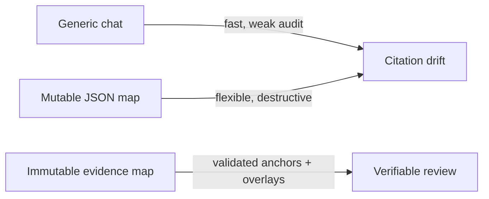

# ADR-0001: Evidence-first immutable Research Maps

## Status

Accepted on 2026-08-12.

## Context

Glyph needs to help a Chinese-speaking quantitative-finance researcher understand a paper quickly without turning model output into an unauditable answer. A research conclusion must remain connected to the exact processed source, survive regeneration, expose source changes, and accept human review without rewriting what the model originally produced.

The application is local-first, pre-1.0, and single-user. SQLite portability, safe migration from existing Reader data, deterministic mock testing, and provider neutrality are required. Generic document chat, cloud collaboration, and claims of scientific truth are outside this decision.

## Decision

Store each generated Research Map as an immutable version of controlled ontology nodes with exact Reader-block evidence anchors; store human review as append-only overlays and activate a new version only after validation, audit, and atomic persistence succeed.

### Decision details

| Item | Content |
| --- | --- |
| **Decision** | Immutable relational map versions, exact evidence anchors, and separate review overlays. |
| **Why now** | Research Map is Glyph's first differentiated product surface and establishes contracts that later formula and cross-paper work will consume. |
| **Why this** | It makes every supported claim inspectable, makes source drift explicit, and preserves both AI and human history without provider lock-in. |
| **Known unknowns** | Real-paper extraction quality and ontology coverage outside empirical asset pricing still require benchmark expansion. |
| **Kill criteria** | Reconsider the schema if representative benchmarks show that exact block anchors cannot cover most supported conclusions without forcing misleading claims. |

## Rationale

### Options considered

1. **Generic document chat with citations**
   - Pros: familiar interaction; small initial UI and storage surface.
   - Cons: conversations are difficult to compare or audit, categories can be skipped silently, and regenerated answers obscure historical changes.

2. **Mutable map JSON attached to each document**
   - Pros: simple persistence and flexible shape.
   - Cons: weak relational integrity, destructive updates, difficult review carry-forward, and no reliable exact-anchor or migration guarantees.

3. **Immutable relational map versions with review overlays (selected)**
   - Pros: deterministic contracts, exact evidence ownership, atomic activation, explainable diffs, and review history independent of model output.
   - Cons: more tables, migrations, loading logic, and explicit version/recovery semantics.

## Consequences

### Positive consequences

- Unknown ontology, provenance, locator, relation, and review values fail at boundaries.
- Old versions and cited Reader blocks remain readable after regeneration or failure.
- Human corrections never become author text or silently overwrite the AI draft.
- Local mock and authenticated CLI providers use the same domain contracts.

### Negative consequences

- The local executor supports one process and one worker, not distributed deployment.
- A partial map can be useful but requires visible issue handling throughout the UI and API.
- Source snapshots, versions, and review history increase database size.

### Neutral consequences

- Formula derivation, cross-paper graphs, accounts, sharing, and investment advice remain separate future decisions.

## Implementation guidance

- Validate evidence before synthesis and never trust provider-supplied document/page identity.
- Keep provider protocols independent of FastAPI, SQLAlchemy routes, and a specific CLI.
- Treat completed versions as immutable except for the active flag.
- Carry a review forward only on an exact node-signature match within the same document.
- Keep errors safe for users while retaining internal tracebacks in local logs.

## Related information

- [Research Map design](../plans/2026-08-12-research-map-design.md)
- [Research Map implementation plan](../plans/2026-08-12-research-map.md)
- [Research Map operations and trust guide](../research-map.md)
