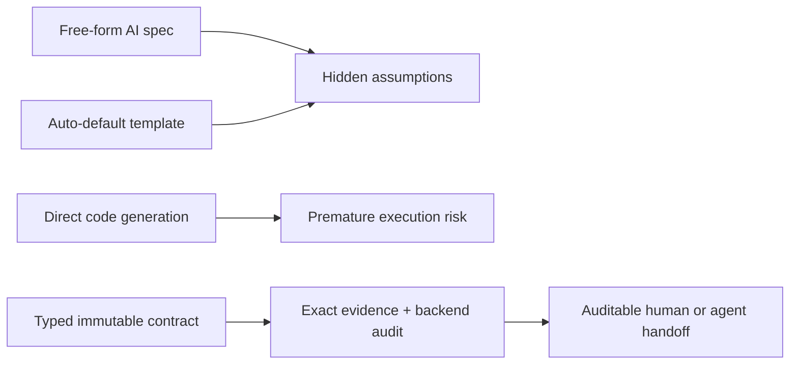

# ADR-0002: Auditable Implementation Contracts with backend-owned readiness

## Status

Accepted on 2026-08-13.

## Context

Research Map can prove what a quantitative paper says, but implementation still requires decisions about data availability, timing, portfolio rules, evaluation, and omitted frictions. A free-form model response can hide whether a value came from the author, inference, or an invisible default. Direct code generation would compound that ambiguity by turning unreviewed text into executable behavior.

Glyph is a trusted, single-user, local-first, pre-1.0 application. The solution must preserve exact Reader evidence, immutable Research Map lineage, provider neutrality, SQLite portability, deterministic testing, and the previous usable version after failure. Future Reproduction Lab work needs a trustworthy input contract, but execution is outside this decision.

## Decision

Store each Implementation Contract as an immutable typed version whose exact evidence and deterministic backend audit establish readiness; keep human resolutions as append-only overlays, and never allow provider output to set readiness.

### Decision details

| Item | Content |
| --- | --- |
| **Decision** | Backend-owned readiness over immutable typed drafts, exact anchors, and append-only human resolution overlays. |
| **Why now** | Implementation Contract is the handoff between evidence review and any future code/reproduction surface, so its trust semantics must be durable before execution exists. |
| **Why this** | It makes missing assumptions visible, separates AI and human responsibility, permits deterministic re-audit/export, and preserves history across provider or source changes. |
| **Known unknowns** | Gold fixtures do not yet establish vocabulary coverage across every quantitative-finance methodology or licensed-data convention. |
| **Kill criteria** | Reconsider the fixed contract schema if representative benchmarks cannot express most implementation-critical requirements without unsafe free-form escape fields or misleading readiness. |

Readiness is computed from accepted anchors, controlled typed values, current append-only resolutions, and deterministic invariants. Provider fields may propose draft items, origins, values, rationale, and evidence references only; all cross-document identity, exact-anchor acceptance, effective values, issues, and readiness belong to the backend.

Human resolutions never rewrite the AI draft. Each resolution records its revision, superseded revision, request ID, reason, contract version, and item signature. It affects a later version only when the item signature is exactly identical within the same document.

## Rationale

### Options considered

1. **Free-form AI implementation specification**
   - Pros: smallest schema and prompt; flexible for unfamiliar paper types.
   - Cons: no controlled vocabulary, deterministic diff, exact carry-forward, reliable blocker count, or proof that omissions were not silently filled.

2. **Auto-default templates for missing implementation values**
   - Pros: quickly produces a superficially complete checklist and reduces user review.
   - Cons: converts absence into an unaudited assumption, creates look-ahead and cost-model risk, and can falsely claim implementation readiness.

3. **Direct code generation from the Research Map**
   - Pros: short path to a runnable artifact and compelling initial demonstration.
   - Cons: expands the trust boundary to code execution, data acquisition, sandboxing, and output validation before assumptions are explicit; generated code can conceal fabricated defaults.

4. **Immutable typed contract, backend audit, and append-only overlays (selected)**
   - Pros: exact provenance, deterministic readiness/diffs/exports, provider neutrality, explicit missing values, atomic activation, conflict-safe human review, and a stable future input boundary.
   - Cons: larger schema, migrations, more validation, more UI states, and deliberate human work before a contract can become ready.

## Consequences

### Positive consequences

- `missing` cannot silently become zero, false, empty, or not-applicable.
- Generation success and implementation readiness remain independent.
- Exact source evidence, AI drafts, derivations, and human decisions remain distinguishable.
- Stale activation cannot claim currentness, and failed generation preserves the prior active contract.
- JSON and Markdown exports can be freshly re-audited and safely consumed as data.
- Future Reproduction Lab work receives a versioned, explicit input contract instead of raw model prose.

### Negative consequences

- Vocabulary and audit-rule changes require coordinated domain, schema, fixture, API, frontend, migration, and documentation tests.
- Some contracts remain blocked until a user supplies a reasoned desk decision.
- Exact-signature carry-forward intentionally creates repeat review when evidence, rationale, origin, type, or value changes.
- A ready contract still cannot prove scientific validity, data availability, reproducibility, or profitability.

### Neutral consequences

- The local persistent executor remains single-process and single-worker.
- Historical versions, evidence, and resolutions increase local database size.
- Interview Defense, cross-paper comparison, accounts, sharing, and hosted sync remain separate features.

## Implementation guidance

- Derive document, Map, block, page, and source identity in trusted backend code; never accept provider-supplied identity.
- Validate evidence before synthesis and audit readiness after applying the latest valid resolution overlays.
- Keep completed drafts and historical resolutions immutable; use append-only records and atomic active-version changes.
- Re-audit before every export. Preserve explicit `NOT IMPLEMENTATION READY` markers whenever readiness is not `implementation_ready`.
- Treat formulas, code-like strings, Markdown, and exported fields as inert untrusted data; never execute them.
- Carry a resolution forward only on exact item-signature equality within the same document.
- Preserve the previous active contract on provider, validation, job, or persistence failure.
- A future Reproduction Lab must consume an explicitly selected, current, audited version and add separate decisions for data access, sandboxed execution, output provenance, and reproduced-result comparison. It must not reinterpret `missing` or provider output.

## Related information

- [ADR-0001: Evidence-first immutable Research Maps](ADR-0001-evidence-first-research-map.md)
- [Implementation Contract design](../plans/2026-08-12-implementation-contract-design.md)
- [Implementation Contract implementation plan](../plans/2026-08-12-implementation-contract.md)
- [Implementation Contract operations and trust guide](../implementation-contract.md)
