# Implementation Contract

Implementation Contract turns one current Research Map into a typed, evidence-backed handoff for a human or coding agent. It identifies what a paper states, what Glyph derives, what a user decides, and what remains unresolved. It does not write or execute a backtest.

The contract is an audit aid, not investment advice. `implementation_ready` means that Glyph's deterministic structural rules pass; it is not proof that the paper is correct, reproducible, or profitable.

## Workflow

```mermaid
flowchart LR
    reader["Current bilingual Reader"] --> map["Immutable Research Map"]
    map --> extract["Typed requirement extraction"]
    extract --> anchors["Exact-anchor validation"]
    anchors --> audit["Backend readiness audit"]
    audit --> version["Atomic immutable version"]
    version --> review["Append-only human resolutions"]
    review --> export["Freshly audited JSON or Markdown"]
```



1. Process a document and generate or review its current Research Map.
2. Select **Build Implementation Contract** from that exact Map version. The persistent job validates the document, source hash, and selected Map before generation.
3. Review **Data availability** and confirm that the required datasets, fields, frequency, and availability lag are implementable.
4. Review **Universe and sample**, then **Signal and timing**, including formation, lookback, and direction.
5. Review **Portfolio construction**, then **Evaluation and frictions**, including rebalance, holding period, benchmark, costs, and known biases.
6. Resolve blockers explicitly and export. Leave an unknown blocked, record a reasoned human decision, or use not-applicable only where the contract permits it. Never accept an inferred default merely to obtain a ready label.

Contract, Research Map, and Reader links preserve stable item, node, and block IDs. If a stored target no longer exists after a version or document change, Glyph selects the first valid item and announces the fallback.

## Origins and effective values

Every item has exactly one effective origin. Provider drafts may use `author_explicit`, `derived`, or `missing`; `human_decision` appears only after a valid user resolution:

| Origin | Meaning | Required support |
| --- | --- | --- |
| `author_explicit` | The paper states the value. | At least one direct supporting Reader anchor. |
| `derived` | Glyph combines multiple paper passages. | At least two supporting anchors and a visible rationale. |
| `human_decision` | A user supplied or changed the effective value. | An append-only resolution with a typed value and reason. |
| `missing` | The value is unresolved. | No fabricated value; a blocking, non-optional item remains blocked. |

The provider creates an immutable draft. Confirming or questioning a supported item records review without changing its draft value. A later `corrected` or `decided` resolution changes only the effective value and effective origin. The draft, evidence, and earlier resolutions remain available for audit.

### Missing is not zero or not-applicable

`missing` means Glyph cannot find or safely derive an implementation value. It never means `0`, `false`, an empty list, or `not_applicable`. Those are substantive choices with different effects:

- zero transaction cost is an explicit cost assumption, not absence of an assumption;
- `not_applicable` requires a reason, no replacement value, and an item that the schema marks optional;
- a missing blocking value stays `blocked` unless a valid human decision resolves it;
- gross replication is an explicit transaction-cost model: record the structured scalar value `gross_replication` with a reason instead of marking the mandatory cost field not applicable.

Neither a provider, backend service, UI, nor exporter inserts a fallback for a missing value.

## Generation status and readiness

Generation status describes whether a version was built: `building`, `complete`, `partial`, or `failed`. Readiness is a separate backend-owned result:

| Readiness | Meaning |
| --- | --- |
| `blocked` | At least one deterministic error or unresolved blocking value remains. |
| `review_needed` | No structural blocker remains, but one or more supported items or warnings still require explicit review. |
| `implementation_ready` | The current effective values pass the deterministic audit with no remaining issues. |

Provider output cannot set readiness. The backend re-audits accepted evidence, human overlays, temporal consistency, availability, rebalance and holding relationships, benchmark/metric compatibility, and blocker rules. Export runs the audit again and reports its fresh result as `readiness` and `readiness_marker`.

An `implementation_ready` contract can still encode a bad research idea, depend on unavailable licensed data, reproduce a false result, or lose money. Glyph does not evaluate profitability or investment suitability.

## Evidence and trust boundary

Paper text is untrusted data. The CLI provider receives delimited, bounded Reader blocks and strict JSON schemas. Glyph supplies no tool or network access to the provider invocation. Backend validation, not provider output, determines document identity, Research Map identity, block ownership, page number, source hash, offsets, and readiness.

For each accepted anchor Glyph verifies that:

- the block belongs to the target document and current processed source;
- `quote_start:quote_end` selects `quote_text` exactly, or a unique quote is used to derive offsets;
- an optional Research Map node belongs to the selected Map and same document;
- locator, relation, section, item type, origin, and typed-value vocabulary are controlled;
- absolute paths, URLs, HTML, non-finite numbers, malformed structures, and cross-document identifiers are rejected.

Exact anchoring proves where text came from, not whether OCR, translation, the author, or a derivation is correct. Inspect the original page before relying on a material assumption.

## Versions, staleness, and resolutions

A completed contract version is immutable except for which version is active. Generating a replacement never mutates the old version. A version is current only while both its document source hash and selected Research Map signature still match current inputs. Activating a stale history version changes the active version; it does not make that version current. Historical evidence links load the exact retained Reader source snapshot and exact Research Map version recorded by that Contract, rather than substituting the document's current lineage.

Deterministic diffs classify each stable `item_key` as `unchanged`, `type_changed`, `value_changed`, `origin_changed`, `evidence_changed`, `added`, or `removed`. History responses are newest-first, default to 50 versions, and accept a bounded `limit` from 1 through 100.

Human resolutions are append-only revisions with a request ID, contract version, stable item key, and item signature. The signature includes that `item_key` plus normalized type, draft value, origin, rationale, and evidence hashes. A resolution carries forward only within the same document when both the item key and signature are byte-for-byte identical. Any change to either identity component requires new review. A stale signature or conflicting request returns `409`; reload the contract before deciding again.

## Exports

Exports are deterministic UTF-8 typed JSON or escaped Markdown in English, Traditional Chinese, or bilingual form. The filename is `implementation-contract-{version_id}.json` or `.md`. A blocked or review-needed Markdown export begins with `# NOT IMPLEMENTATION READY`; JSON exposes the same boundary in `readiness_marker`.

Canonical JSON contains:

- top level: export and contract schema versions, contract/document/Map IDs, source and Map signatures, language, fresh and persisted generation/readiness states, current/stale flags, `items`, and `issues`;
- item: stable IDs and keys, section/type, draft and effective typed values, draft and effective origins, rationale, blocking/optional flags, signature, evidence, current decision, and decision history;
- evidence: block and optional Map-node IDs, page and locator, exact offsets, source quote hash, relation, label, verbatim source quote, and translated context when requested;
- decision: revision/supersession IDs, status, typed replacement, reason, based-on version/signature, idempotent request ID, and timestamp;
- issue: stable code, severity, message, and optional item key.

Markdown renders the same audit state, ordered sections, typed draft/effective values, exact evidence coordinates and hashes, decision history, and issues. Exported formulas and code-like text remain data. Glyph never evaluates or executes them.

Treat exports as sensitive: they can contain verbatim document text, translations, hashes, research choices, and local decision history. Save them only to trusted paths, review before sharing, and never execute generated strings as shell, SQL, Python, or another language.

## Local CLI

`./scripts/setup.sh` installs the `glyph-contract` entry point into `.venv/bin/`. Commands use the same local database, provider, evidence validation, audit, and export services as the application.

```bash
.venv/bin/glyph-contract list
.venv/bin/glyph-contract show DOCUMENT_ID
.venv/bin/glyph-contract generate DOCUMENT_ID --map-version MAP_VERSION_ID
.venv/bin/glyph-contract export CONTRACT_VERSION_ID \
  --format json \
  --language bilingual \
  --output data/exports/contract.json
```

`generate` is synchronous and local to the command. Omit `--map-version` to use the eligible active Research Map. `show` returns the active effective contract as JSON. Export format choices are `json` and `markdown`; language choices are `en`, `zh-TW`, and `bilingual`.

## HTTP API

The browser uses persistent background jobs:

```bash
curl -sS -X POST http://127.0.0.1:8000/api/documents/DOCUMENT_ID/implementation-contract \
  -H 'Content-Type: application/json' \
  -d '{"research_map_version_id":"MAP_VERSION_ID"}'

curl -sS http://127.0.0.1:8000/api/implementation-contract-jobs/JOB_ID
curl -sS http://127.0.0.1:8000/api/documents/DOCUMENT_ID/implementation-contract
curl -sS 'http://127.0.0.1:8000/api/documents/DOCUMENT_ID/implementation-contract/versions?limit=50'
curl -sS 'http://127.0.0.1:8000/api/implementation-contracts/VERSION_ID/diff?against=OTHER_VERSION_ID'
curl -sS -OJ 'http://127.0.0.1:8000/api/implementation-contracts/VERSION_ID/export?format=markdown&language=bilingual'
```

Append a reasoned decision using the item signature from the contract currently on screen:

```bash
curl -sS -X PATCH http://127.0.0.1:8000/api/implementation-contract-items/ITEM_ID/resolution \
  -H 'Content-Type: application/json' \
  -d '{
    "request_id":"desk-decision-001",
    "status":"decided",
    "based_on_item_signature":"64_LOWERCASE_HEX_CHARACTERS",
    "resolved_value":{"kind":"scalar","value":"monthly"},
    "reason":"Desk implementation uses month-end data availability."
  }'

curl -sS -X POST http://127.0.0.1:8000/api/implementation-contracts/VERSION_ID/activate
```

Expected errors are `404` for absent resources, `409` for stale/conflicting state or duplicate active jobs, and `422` for invalid controlled vocabulary, typed values, evidence, resolution shape, or export options.

## Provider configuration and privacy

Use the deterministic provider for development:

```dotenv
GLYPH_AI_MODE=mock
GLYPH_OCR_MODE=mock
```

For real documents, select an already-authenticated local CLI boundary:

```dotenv
GLYPH_AI_MODE=claude_cli
# or GLYPH_AI_MODE=codex_cli
GLYPH_CLI_MODEL=
GLYPH_CLI_TIMEOUT_SECONDS=300
GLYPH_CLI_CONCURRENCY=3
GLYPH_CONTRACT_CLI_BLOCK_BATCH_SIZE=8
GLYPH_RESEARCH_JOB_MAX_ATTEMPTS=2
```

Local-first describes Glyph's storage and execution, not offline inference. The selected CLI may send bounded document text to its provider under that account's terms, retention policy, plan, and usage limits. Provider cache entries are stored locally under `data/implementation-contract-ai-cache/`. Server logs can contain diagnostic context and must be protected.

## Backup, migration, and recovery

Stop Glyph before backup, then copy both `data/` and `book/` to protected storage. They may contain the SQLite database, complete source text, translations, provider cache, page images, evidence, resolutions, and exports.

Backend startup applies forward Alembic migrations automatically. Revision `0004_implementation_contracts` adds immutable versions, typed items, evidence, append-only resolutions, issues, and persistent jobs without inventing contract rows or rewriting existing Reader/Map content. Revision `0005_contract_job_map_selection` records the exact requested Map for queued jobs. SQLite foreign-key enforcement is enabled on every runtime connection. Back up before upgrading. Glyph has no automatic backup, supported automatic downgrade, or destructive schema reset; unknown partial schemas are rejected.

Queued and running contract jobs persist in SQLite. At startup, an interrupted running job below `GLYPH_RESEARCH_JOB_MAX_ATTEMPTS` is returned to `queued`; repeated interruption marks it safely `failed`. Only one queued/running job per document and one process-local worker are supported. Do not scale this executor by starting multiple application processes.

Generation persists and activates a new version only after validation and audit complete in one transaction. Provider failure, interruption, validation rejection, or persistence rollback leaves the prior active contract unchanged and readable. Successful document reprocessing replaces current Reader output while retaining any historical blocks cited by either Research Map or Implementation Contract evidence. After a failed job, inspect the safe UI/API error and protected local logs, fix the input/provider problem, confirm the Reader and Map are current, then enqueue a new job.

## Limitations and future boundary

Implementation Contract does not:

- obtain or license datasets;
- generate, run, sandbox, or verify executable strategy code;
- execute backtests or compare reproduced returns;
- validate scientific truth, profitability, risk suitability, or investment merit;
- provide investment advice, portfolio recommendations, hosted collaboration, or cross-paper synthesis.

Future Reproduction Lab work may consume only an explicitly selected, freshly audited contract. Execution, dataset access, sandboxing, cost models, output provenance, and reported-versus-reproduced comparisons require a separate architecture decision. They must not weaken the current evidence, missing-value, readiness, or append-only history guarantees.

## Verification

Run the deterministic gold benchmark after changing contract vocabulary, evidence, audit, provider, or export behavior:

```bash
.venv/bin/pytest backend/tests/test_contract_benchmark.py -q
```

For all quality gates, see [CONTRIBUTING.md](../CONTRIBUTING.md). The durable architecture decision is [ADR-0002](adr/ADR-0002-auditable-implementation-contract.md).
