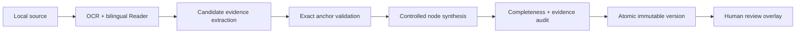

# Research Map

Research Map is Glyph's evidence-first view for empirical asset-pricing and quantitative-strategy papers. It organizes a paper into six bounded questions—research question, data/sample, signal, method, primary result, and limitations—and keeps each supported conclusion linked to an exact bilingual Reader block.

It is a review aid, not an independent scientific validator or investment recommendation. A direct anchor proves where text came from; it does not prove that the paper's method or conclusion is correct.

## Workflow



1. Process a document to produce a current Reader snapshot.
2. Select **Research Map** in the Library. If no active version exists, select **Generate Research Map**. After a source change, reprocess the document and select **Generate new version**; the stale version stays readable while the persistent job runs.
3. The HTTP request creates a persistent queued job. A local single-worker executor records evidence, validation, synthesis, audit, and persistence progress outside the request.
4. Use the five-step guided review or the six-category outline. Open the Evidence Inspector to compare verbatim English, the aligned Traditional Chinese block translation, page, locator, and evidence relation.
5. Select **View in Reader** to focus the exact persisted block. **Return to Research Map** restores the selected node and Inspector.
6. Confirm, question, or correct a node. A correction changes the effective display value but preserves the original AI draft and earlier reviews.

## Evidence and audit contract

For every accepted evidence anchor Glyph proves that:

- the Reader block belongs to the target document and processed source hash;
- `quote_start:quote_end` selects `quote_text` exactly;
- a quote without provider offsets occurs exactly once before offsets are derived;
- the locator, relation, ontology type, provenance, and evidence quality are controlled values;
- duplicate anchors are removed deterministically;
- provider output cannot place absolute paths, HTML, or URLs in structured fields.

`author_explicit` requires direct supporting evidence. Normal `ai_synthesis` requires at least two supporting accepted anchors. `not_reported` means the paper explicitly does not report a quantity; it never means zero. Missing categories, unsupported claims, conflicting evidence, and missing statistical details create structured issues and a visible `partial` map.

The exact source guarantee has limits. OCR can be wrong, translation can be wrong, a quoted author statement can be false, and an apparently complete paper can omit important assumptions. Inspect original pages and apply domain judgment before relying on a result.

## Providers and privacy

`GLYPH_AI_MODE=mock` is deterministic and intended for development. `claude_cli` and `codex_cli` use the user's already-authenticated CLI and do not store an API key in Glyph. Research Map extraction and synthesis use strict JSON schemas, bounded block batches, timeouts, and no tool or network access supplied by Glyph.

Local-first describes Glyph storage and execution, not offline inference. A selected CLI may send extracted paper text to its provider under that account's terms, retention policy, plan, and usage limits. Glyph does not add product telemetry or upload document contents to a Glyph service.

Relevant configuration:

| Variable | Default | Purpose |
| --- | --- | --- |
| `GLYPH_AI_MODE` | `claude_cli` | `claude_cli`, `codex_cli`, or deterministic `mock` |
| `GLYPH_CLI_MODEL` | provider default | Optional shared CLI model override |
| `GLYPH_CLI_TIMEOUT_SECONDS` | `300` | Limit for each CLI invocation |
| `GLYPH_CLI_CONCURRENCY` | `3` | Concurrent provider calls inside bounded batches |
| `GLYPH_RESEARCH_CLI_BLOCK_BATCH_SIZE` | `12` | Reader blocks per evidence-extraction request |
| `GLYPH_RESEARCH_JOB_MAX_ATTEMPTS` | `2` | Startup interruption limit before a job safely fails |

## Versions, reviews, and source changes

A completed map version is immutable except for its active flag. Generation validates and audits all nodes before one transaction persists and activates the new version. A failure leaves the previous active version unchanged.

Reviews are append-only revisions based on the visible map version and node signature. A review carries to another version only when the signature of ontology type, normalized claim, and sorted evidence hashes is identical. A signature conflict returns `409`; reload the Map and review the changed claim again.

If source bytes change, the active map becomes stale immediately. The previous Reader and Map remain readable, but a current map cannot be generated until the document is reprocessed. After reprocessing, **Generate new version** creates and atomically activates a current version. Reader reprocessing retains old blocks cited by immutable map versions while excluding them from the current Reader.

## Recovery and deployment boundary

Queued jobs persist in SQLite. On application startup, an interrupted running job is returned to queued state if it remains below `GLYPH_RESEARCH_JOB_MAX_ATTEMPTS`; repeated interruption records a safe failed state. Only one queued/running map job per document is allowed.

The executor is intentionally process-local and single-worker. Do not run multiple application processes against the same local executor design or treat it as a distributed queue. Glyph remains a trusted single-user loopback application without authentication, TLS, or tenant isolation; never expose it directly to a network.

## Backup and migration

Stop Glyph before making a consistent backup, then copy both `data/` and `book/` to protected storage. They may contain complete source text, translations, reviews, uploads, page images, SQLite data, and provider cache entries.

Startup applies forward Alembic migrations. Revision `0003_research_maps` adds Research Map tables without inventing map rows or rewriting existing Reader data. Back up before upgrading; there is no automatic backup or supported destructive reset. Unknown partial schemas are rejected.

## API resources

- `POST /api/documents/{document_id}/research-map` — enqueue generation (`202`)
- `GET /api/research-map-jobs/{job_id}` — persistent stage/progress
- `GET /api/documents/{document_id}/research-map` — active effective map
- `GET /api/documents/{document_id}/research-map/versions` — compact version history
- `GET /api/research-maps/{version_id}` — explicit immutable version
- `GET /api/research-maps/{version_id}/diff?against={other_version_id}` — deterministic node diff
- `PATCH /api/research-nodes/{node_id}/review` — append a review revision
- `POST /api/research-maps/{version_id}/activate` — activate an eligible version

The document list contains an optional nested active-map summary. It is loaded in bounded batches, not one request or database query per document.

## Verification

The deterministic empirical-asset-pricing benchmark processes an original fixture through mock OCR/translation and Research Map generation, then checks six-category coverage, exact anchors, statistical evidence, `not_reported`, deterministic regeneration, and bounded provider calls:

```bash
.venv/bin/pytest backend/tests/test_research_benchmark.py -q
```

For all contributor gates, see [CONTRIBUTING.md](../CONTRIBUTING.md).
